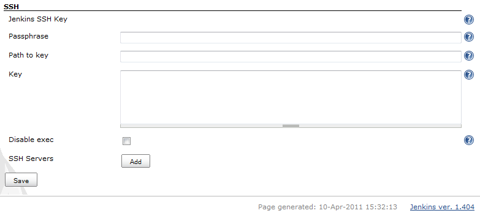
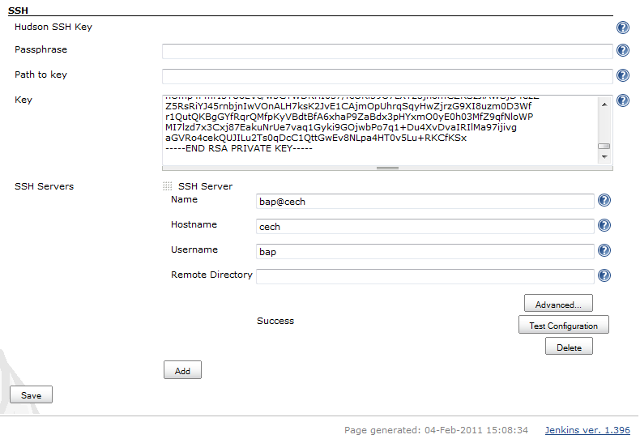
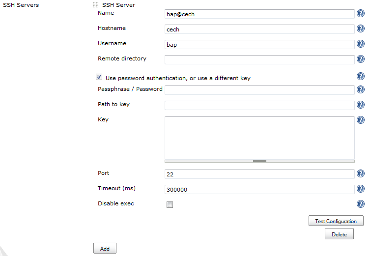
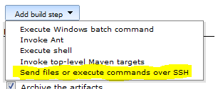
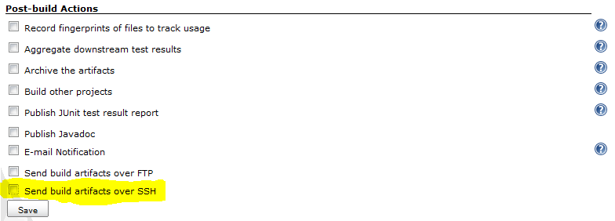
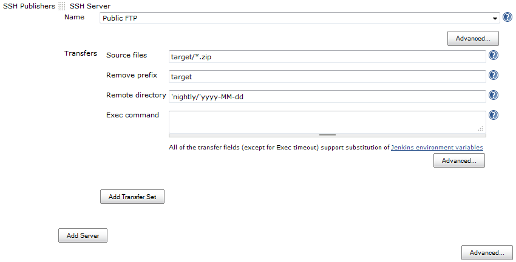
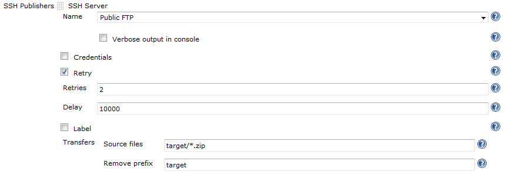
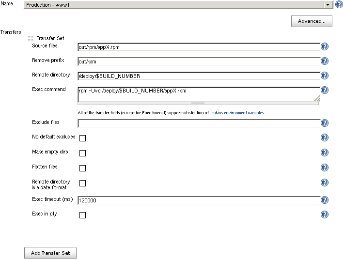
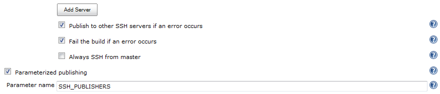
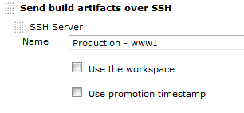

# Publish Over SSH Plugin for Jenkins

This plugins shares many configuration options with two similar plugins:
* [Publish over CIFS](https://plugins.jenkins.io/publish-over-cifs/)
* [Publish over FTP](https://plugins.jenkins.io/publish-over-ftp/)
Please read [Publish
Over](https://wiki.jenkins.io/display/JENKINS/Publish+Over) first to learn about their common configuration options. Only options specific to Publish over SSH are documented below.

## Features

-   SCP - Send files over SSH (SFTP)
-   Execute commands on a remote server (can be disabled for a server
    configuration, or for the whole plugin)
-   Use username and password (keyboard-interactive) or public key
    authentication
-   Passwords/passphrases are encrypted in the configuration files and
    in the UI
-   SSH SFTP/ SSH Exec can be used as a build step during the build
    process (Freestyle and Matrix projects)
-   SSH before a (maven) project build, or to run after a build whether
    the build was successful or not (see [Build
    wrappers](/README.md#PublishOverSSHPlugin-wrappers)
    below)
-   The plugin is "promotion aware" (send files directly from the
    artifacts directory of the build that is being promoted) see
    [Promotions](https://wiki.jenkins.io/display/JENKINS/Publish+Over#PublishOver-promotions)
-   Optionally override the authentication credentials for each server
    in the job configuration (or provide them if they have not been
    provided for that server in the global configuration)
-   Optionally retry if the transfer of files fails (useful for flakey
    connections)
-   Enable the command/ script to be executed in a pseudo TTY

### Build wrappers

There will be two new options in the **Build Environment** section of
the job configuration

1.  Send files or execute commands over SSH before the build starts  
    This allows SSH to be used before a build begins, but after the
    workspace has been configured and source checked out  
    Most useful for maven project types
2.  Send files or execute commands over SSH after the build runs  
    As long as the build was attempted, this will run after the build
    finishes, and will run whether the build is successful or not  
    This allows cleanup or shutdown of services started before or during
    the build  
    Use the publisher (Send build artifacts over SSH in Post-build
    Actions) to publish build artifacts from successful builds

## Global Configuration

From the Jenkins home page, click "Manage Jenkins" and then click on
"Configure System" and find the SSH section. 
It allows you to configure hosts that are later available in your builds.

### Default settings
The SSH configuration section looks like this:

This configures the default key that will be used by all of the SSH
configurations.  
The simplest way to configure the key is to paste an unencrypted key
into the Key box.  
To configure, set **either** the path to a file containing the key
**or** paste the key into the Key field.  
If you enter data into both Path to key and Key, the pasted Key will
take precedence and the Path to file will be ignored.

These settings are use for all hosts by default.

#### Unencrypted keys

If you plan to give read access to the Jenkins configuration page to non
administrators, then you should ensure that you only use private keys
encrypted with strong passphrases.  
The passphrase itself will be encrypted when the configuration is saved,
and will also be encrypted in the UI so that the value cannot be read.

#### Passphrase

If the key is encrypted with a passphrase then set it here.

#### Path to file

The location, on the Jenkins master, of the private SSH key to use.  
The path can be an absolute path to the key, or relative to the
JENKINS\_HOME directory.

#### Key

Paste the private key into this box.  
The key should include both the header and footer lines (----) and
everything in between.

#### Disable exec

This option will remove the ability to execute commands from this
plugin.  
If this option is checked, then the Disable exec option in the Advanced
section of an SSH Server will be ignored.

### Add an SSH Server

Click on the "Add" button next to "SSH Servers"  

Fill in Name, Hostname, Username and Remote Directory. [see Publish Over
... for common options for Host
Configurations](https://wiki.jenkins.io/display/JENKINS/Publish+Over#PublishOver-host)

#### Username

The user that will be used to connect to the host.  
This user will need the public key in their authorized\_keys file on the
remote host (if using public key authentication).

#### Advanced options

[see Publish Over ... for common options for Host
Configurations](https://wiki.jenkins.io/display/JENKINS/Publish+Over#PublishOver-host)

##### Use password authentication, or use a different key

Selecting this option will produce 3 more configuration boxes that
mirror the options available for the Jenkins SSH Key.

##### Passphrase / Password

If either Path to key or Key are configured then this is the passphrase
to use with the encrypted key.  
If no key is configured then this is the password that will be used for
password authentication.

##### Path to key

See [description above](/README.md#default-settings).

##### Key

See [description above](/README.md#default-settings).

##### Disable exec

This option will remove the ability to execute commands using this
configuration.

##### Add the public key to the remote server

Ensure that the public key (counterpart to the private key configured
above) is in the authorized keys file for the user that you connect as
on the server you want to connect to.

##### Check and save configuration
* Click "Test Configuration".
* Add more server configurations (if required)
* Save

## Use SSH during a build

This plugin includes a builder which enables the use of the publisher
during the build process.

This means that you can send newly created packages to a remote server
and install them, start and stop services that the build may depend on
and many other use cases.  

### Configure a job to Publish Over SSH

[see Publish Over ... for common options for
Server](https://wiki.jenkins.io/display/JENKINS/Publish+Over#PublishOver-server)

[see Publish Over ... for common options for Transfer
Sets](https://wiki.jenkins.io/display/JENKINS/Publish+Over#PublishOver-transfer)

#### Exec command

If there is anything in this configuration box then it will be executed
on the remote server.  
If Source files are configured, then the files will be transfered before
the Exec command is executed.  
If the exit status of the command is not zero, then the publish will
fail.  
STDOUT and STDERR from the command execution are recorded in the Jenkins
console.

Source files, Exec command

You must configure Source files, Exec command or both.  
If neither Source files nor Exec command are configured, the publish
will fail.  
If the Source files box is empty then no files will be transferred.

Environment variables

Source files, Remove prefix, Remote directory and Exec command can all
use the Jenkins environment variables and build parameters.

#### Advanced (Server)

#### Advanced (Transfer Sets)

[see Publish Over ... for details of common
options](https://wiki.jenkins.io/display/JENKINS/Publish+Over#PublishOver-transfer)

#### Exec timeout (ms)

Configure a timeout for the Exec command to use.  
If the command has not returned within this time then the publish will
fail.

#### Exec in pty

Run the Exec command in a pseudo TTY.

#### Advanced (Publisher)

If you click the "Advanced..." button that is immediately below the "Add
Server" button, you will make more configuration options available.

[see Publish Over ... for common options for
Publisher](https://wiki.jenkins.io/display/JENKINS/Publish+Over#PublishOver-publisher)

#### Options to override the default Promotion behaviour

If you are configuring an action in a promotion, new options will become
available.

[see Publish Over ... for common options for
Promotions](https://wiki.jenkins.io/display/JENKINS/Publish+Over#PublishOver-promotions)

## Version History

Release notes are now recorded in [Github Releases](https://github.com/jenkinsci/publish-over-ssh-plugin/releases).

For older versions, refer to [changelog](CHANGELOG.md).
